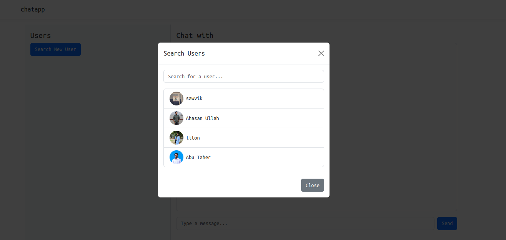
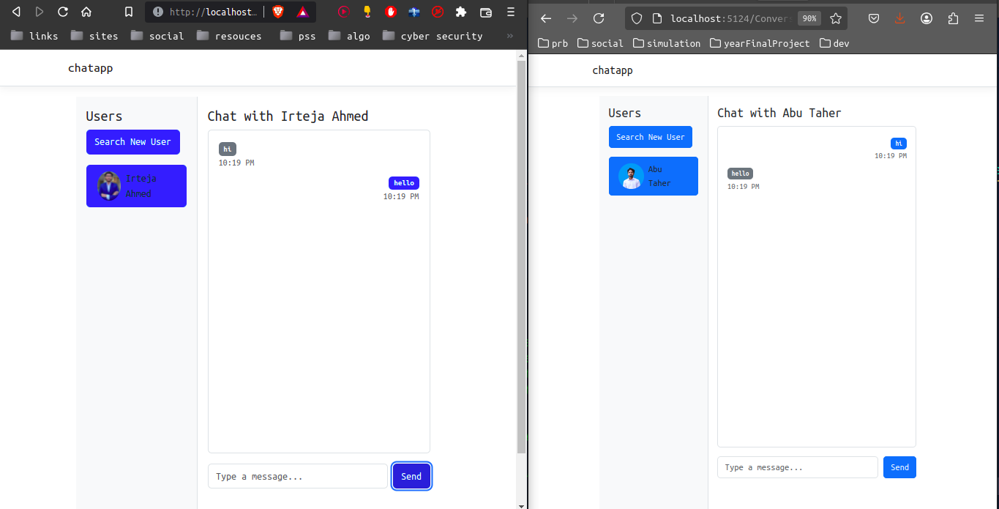

# 💬 ASP.NET Chat Application

A real-time web-based chat application built with ASP.NET. This system enables users to create accounts, log in securely, and engage in live messaging with other users through a clean, responsive UI.

## 🔑 Key Features

- 💬 Real-time messaging between users
- 👤 User registration and login
- 🔐 Authentication and authorization using JWT
- 📃 Chat history view
- 🔄 Asynchronous message updates using SignalR

## 🛠️ Technologies Used

- **Backend:** ASP.NET Core 
- **Frontend:** HTML, CSS, JavaScript
- **Authentication:** JSON Web Token (JWT)
- **Database:** Microsoft SQL Server (MSSQL)
- **Real-Time Communication:** SignalR 

## 📸 Screenshots

### Search User 
User can search for other user to whom they want to send message. 

---

### 🧑‍💬 Chat Interface  
Real-time message exchange with live updates and user-friendly design.  

---

## Prerequisites

- .NET SDK (version 8.0.404)
- Visual Studio / VS Code
- SQL Server 
